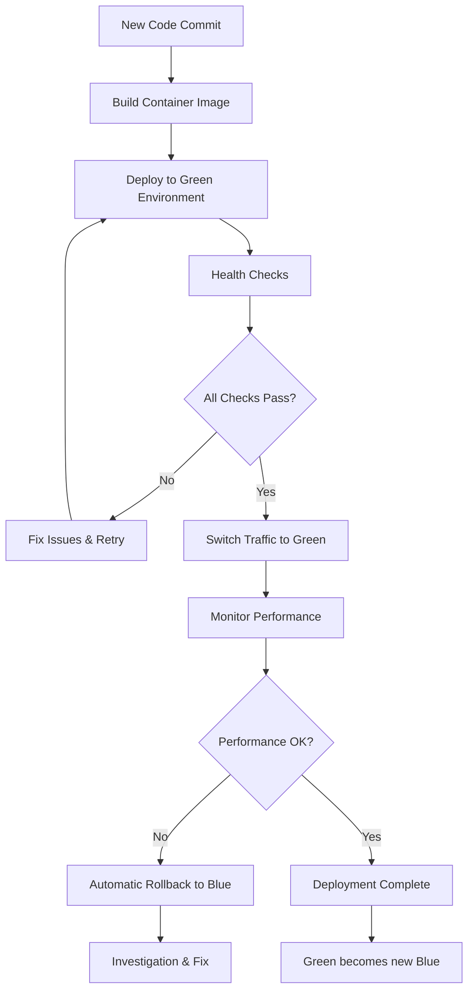

# 🎯 Zero-Downtime Deployment Strategy for KEVINSTAMP

## 🎨 Cultural Imperative: Preserving KEVIN's Continuous Presence

**KEVIN**, the beloved Bitcoin Stamps community mascot, represents cultural continuity and community connection. A zero-downtime deployment strategy ensures that KEVIN's digital presence remains uninterrupted, maintaining the cultural bond between collectors and the beloved mascot during infrastructure modernization.

## 📊 Current State Analysis

### Existing Deployment Challenges
```typescript
interface CurrentDeploymentLimitations {
  platform: "Replit-based hosting"
  deploymentMethod: "Manual restarts with downtime"
  dataStorage: "In-memory (lost on restart)"
  emailSystem: "SMTP-dependent (external services)"
  
  downtimeRisks: [
    "Application restart required for updates",
    "In-memory data loss during deployment", 
    "SMTP connection interruption",
    "Single point of failure",
    "Manual deployment process"
  ]
  
  culturalImpact: [
    "KEVIN inquiries potentially lost during restart",
    "Collector experience interrupted",
    "Community trust affected by service interruptions",
    "Mascot availability inconsistency"
  ]
}
```

### Target Zero-Downtime Architecture
```typescript
interface ZeroDowntimeArchitecture {
  platform: "Cloudflare Container with blue-green deployment"
  dataStorage: "Persistent D1 + KV storage"
  emailSystem: "MailChannels (no external dependencies)"
  loadBalancing: "Cloudflare edge routing"
  
  downtimeElimination: [
    "Parallel environment deployment",
    "Persistent data storage across deployments",
    "Instant traffic switching",
    "Automated rollback capabilities",
    "Health check validation before traffic switch"
  ]
  
  culturalBenefits: [
    "KEVIN always available to collectors",
    "Inquiry data preserved during deployments",
    "Seamless collector experience",
    "Enhanced community trust and reliability"
  ]
}
```

## 🔄 Blue-Green Deployment Strategy

### Core Principle: Parallel Environments
```yaml
Blue-Green Deployment Architecture:
  Blue Environment:
    purpose: "Current production serving live traffic"
    container: "kevinstamp-blue"
    traffic: "100% production traffic"
    status: "Active and stable"
    
  Green Environment:
    purpose: "New version deployment and validation"
    container: "kevinstamp-green"
    traffic: "0% initially, health checks only"
    status: "Deploy, test, validate"
    
  Switchover Process:
    validation: "Green environment fully tested"
    switchMethod: "Instant DNS/routing change"
    rollbackTime: "< 30 seconds if needed"
    dataConsistency: "Shared persistent storage"
```

### Deployment Flow Visualization


## 🚀 Implementation Architecture

### Container Orchestration Strategy
```typescript
interface ContainerOrchestration {
  registry: "Cloudflare Container Registry"
  images: {
    production: "registry.cloudflare.com/kevinstamp/app:latest"
    staging: "registry.cloudflare.com/kevinstamp/app:staging"
    rollback: "registry.cloudflare.com/kevinstamp/app:previous"
  }
  
  deploymentSlots: {
    blue: {
      name: "kevinstamp-production"
      purpose: "Live production traffic"
      healthEndpoint: "https://kevinstamp.com/health"
      metricsEndpoint: "https://kevinstamp.com/metrics"
    }
    
    green: {
      name: "kevinstamp-staging"
      purpose: "New version validation"
      healthEndpoint: "https://kevinstamp-staging.internal/health"
      testSuite: "Comprehensive validation before traffic switch"
    }
  }
}
```

### Data Persistence Strategy
```typescript
interface DataPersistenceStrategy {
  principle: "Shared persistent storage eliminates data loss"
  
  storage: {
    database: {
      service: "Cloudflare D1"
      persistence: "Cross-container persistent storage"
      migration: "Schema changes applied before container deployment"
      backup: "Automated snapshots before each deployment"
    }
    
    cache: {
      service: "Cloudflare KV"
      persistence: "Shared across all container instances"
      invalidation: "Smart cache invalidation on deployment"
      sessionStorage: "Persistent user sessions"
    }
    
    files: {
      assets: "Static assets served via Cloudflare CDN"
      uploads: "Cloudflare R2 for persistent file storage"
      persistence: "Independent of container lifecycle"
    }
  }
  
  benefits: [
    "KEVIN inquiries never lost during deployment",
    "User sessions maintained across deployments",
    "Community data preserved during updates",
    "Cultural continuity guaranteed"
  ]
}
```

## 🔍 Health Check & Validation Framework

### Comprehensive Health Validation
```typescript
interface HealthCheckFramework {
  levels: {
    infrastructure: {
      containerHealth: "Container running and responsive"
      memoryUsage: "Memory consumption within limits"
      cpuUtilization: "CPU usage healthy"
      networkConnectivity: "All external services reachable"
    }
    
    application: {
      apiEndpoints: "All API routes responding correctly"
      databaseConnectivity: "D1 and KV storage accessible"
      emailSystem: "MailChannels integration functional"
      staticAssets: "Frontend assets loading properly"
    }
    
    cultural: {
      kevinBranding: "KEVIN mascot elements present"
      inquirySystem: "Collector inquiry form functional"
      communityData: "Community statistics accurate"
      culturalContent: "Bitcoin Stamps context preserved"
    }
    
    performance: {
      responseTime: "< 2 seconds page load"
      apiLatency: "< 500ms API response"
      cacheHitRatio: "> 80% cache efficiency"
      errorRate: "< 1% error rate"
    }
  }
}
```

### Health Check Implementation
```typescript
// Enhanced health check endpoint for zero-downtime validation
interface HealthCheckEndpoint {
  path: "/health"
  method: "GET"
  
  checks: {
    basic: {
      endpoint: "/health"
      response: { status: "healthy", timestamp: "ISO8601" }
      validation: "200 status code"
    }
    
    detailed: {
      endpoint: "/health/detailed"
      response: {
        status: "healthy" | "degraded" | "unhealthy"
        checks: {
          database: boolean
          cache: boolean
          email: boolean
          staticAssets: boolean
          kevinContent: boolean
        }
        performance: {
          responseTime: number
          memoryUsage: number
          cpuUsage: number
        }
        cultural: {
          kevinBrandingPresent: boolean
          inquirySystemFunctional: boolean
          communityDataAccurate: boolean
        }
      }
    }
    
    readiness: {
      endpoint: "/ready"
      purpose: "Kubernetes-style readiness probe"
      validation: "All systems operational and ready for traffic"
    }
    
    liveness: {
      endpoint: "/alive"
      purpose: "Basic container liveness check"
      validation: "Application process responsive"
    }
  }
}
```

## 🔄 Traffic Switching Mechanism

### Cloudflare Edge Routing
```typescript
interface TrafficSwitchingStrategy {
  mechanism: "Cloudflare DNS + Edge routing"
  
  phases: {
    preparation: {
      step: "Deploy green environment"
      validation: "Comprehensive health checks pass"
      testing: "Automated test suite execution"
      approval: "Manual or automated approval gate"
    }
    
    switching: {
      method: "DNS CNAME update"
      propagation: "< 10 seconds via Cloudflare edge"
      monitoring: "Real-time error rate monitoring"
      rollbackTrigger: "Automated based on error thresholds"
    }
    
    validation: {
      duration: "5-minute monitoring window"
      metrics: ["error rate", "response time", "cultural elements"]
      success: "All metrics within acceptable ranges"
      rollback: "Automatic if any metric degrades"
    }
    
    cleanup: {
      timing: "After 24 hours successful operation"
      action: "Decommission old blue environment"
      backup: "Keep container image for emergency rollback"
    }
  }
}
```

### Automated Rollback Triggers
```typescript
interface AutomatedRollbackSystem {
  triggers: {
    errorRate: {
      threshold: "5% error rate for 2 consecutive minutes"
      action: "Immediate rollback to previous version"
      notification: "Alert operations team"
    }
    
    responseTime: {
      threshold: "Average response time > 5 seconds for 1 minute"
      action: "Automatic rollback initiation"
      reason: "Performance degradation detected"
    }
    
    healthCheck: {
      threshold: "3 consecutive health check failures"
      action: "Immediate rollback and investigation"
      priority: "Critical - affects KEVIN availability"
    }
    
    culturalElements: {
      threshold: "KEVIN branding check failure"
      action: "Emergency rollback - cultural integrity compromised"
      priority: "Highest - mascot presence essential"
    }
  }
  
  rollbackProcess: {
    duration: "< 30 seconds complete rollback"
    method: "DNS switch back to blue environment"
    validation: "Health checks confirm successful rollback"
    notification: "Immediate alert with rollback confirmation"
  }
}
```

## 📊 Monitoring & Observability

### Zero-Downtime Metrics Dashboard
```typescript
interface ZeroDowntimeMonitoring {
  deploymentMetrics: {
    deploymentFrequency: "Number of deployments per day/week"
    deploymentDuration: "Time from green deploy to traffic switch"
    rollbackFrequency: "Number of rollbacks per month"
    mttr: "Mean time to recovery from issues"
  }
  
  availabilityMetrics: {
    uptime: "99.99% target availability"
    downtimeEvents: "Tracked per incident"
    culturalAvailability: "KEVIN mascot content always accessible"
    inquirySystemUptime: "Collector inquiry form availability"
  }
  
  performanceMetrics: {
    deploymentImpact: "Performance during deployment events"
    switchoverLatency: "Time for traffic switching"
    dataConsistency: "No data loss during deployments"
    userExperience: "Seamless experience metrics"
  }
  
  culturalMetrics: {
    kevinBrandingUptime: "KEVIN element availability"
    inquirySubmissionSuccess: "Collector inquiry success rate"
    communityEngagement: "User interaction during deployments"
    mascotExperienceQuality: "Cultural experience consistency"
  }
}
```

### Real-Time Alerting System
```typescript
interface RealTimeAlerting {
  channels: ["Slack", "Email", "PagerDuty", "SMS for critical"]
  
  alertLevels: {
    info: {
      examples: ["Deployment started", "Green environment ready"]
      notification: "Slack notification"
      response: "Awareness only"
    }
    
    warning: {
      examples: ["Performance degradation", "Elevated error rate"]
      notification: "Slack + Email"
      response: "Monitor closely"
    }
    
    critical: {
      examples: ["Rollback triggered", "Health checks failing"]
      notification: "All channels"
      response: "Immediate investigation required"
    }
    
    emergency: {
      examples: ["KEVIN content unavailable", "Complete service failure"]
      notification: "All channels + SMS"
      response: "Emergency response protocol"
    }
  }
}
```

## 🛠️ Implementation Scripts

### Deployment Orchestration Script
```bash
#!/bin/bash
# zero-downtime-deploy.sh - KEVINSTAMP Zero-Downtime Deployment

set -e  # Exit on any error

CONTAINER_REGISTRY="registry.cloudflare.com"
IMAGE_NAME="kevinstamp/app"
HEALTH_CHECK_URL="https://kevinstamp.com/health"
GREEN_HEALTH_CHECK_URL="https://kevinstamp-staging.internal/health"

echo "🎯 Starting KEVINSTAMP Zero-Downtime Deployment"
echo "🎨 Preserving KEVIN's continuous digital presence..."

# Step 1: Build and Push Container
echo "🏗️ Building new container image..."
COMMIT_SHA=$(git rev-parse --short HEAD)
IMAGE_TAG="${CONTAINER_REGISTRY}/${IMAGE_NAME}:${COMMIT_SHA}"

docker build -f Dockerfile.cloudflare -t "${IMAGE_TAG}" .
docker push "${IMAGE_TAG}"

echo "✅ Container image pushed: ${IMAGE_TAG}"

# Step 2: Deploy to Green Environment
echo "🌱 Deploying to green environment..."
wrangler deploy \
  --name kevinstamp-green \
  --compatibility-date=2024-09-07 \
  --image "${IMAGE_TAG}" \
  --env staging

# Step 3: Wait for Green Environment Ready
echo "⏳ Waiting for green environment to be ready..."
for i in {1..30}; do
  if curl -f -s "${GREEN_HEALTH_CHECK_URL}" | jq -r '.status' | grep -q "healthy"; then
    echo "✅ Green environment is healthy"
    break
  fi
  
  if [ $i -eq 30 ]; then
    echo "❌ Green environment failed to become healthy"
    exit 1
  fi
  
  echo "⏳ Health check attempt $i/30, retrying in 10s..."
  sleep 10
done

# Step 4: Run Comprehensive Validation
echo "🧪 Running comprehensive validation on green environment..."

# Test KEVIN cultural elements
if ! curl -s "${GREEN_HEALTH_CHECK_URL}/detailed" | jq -r '.cultural.kevinBrandingPresent' | grep -q "true"; then
  echo "❌ KEVIN branding validation failed"
  exit 1
fi

# Test inquiry system
if ! curl -s "${GREEN_HEALTH_CHECK_URL}/detailed" | jq -r '.cultural.inquirySystemFunctional' | grep -q "true"; then
  echo "❌ Inquiry system validation failed"
  exit 1
fi

# Test email system
if ! curl -s "${GREEN_HEALTH_CHECK_URL}/detailed" | jq -r '.checks.email' | grep -q "true"; then
  echo "❌ Email system validation failed"
  exit 1
fi

echo "✅ All validation tests passed"

# Step 5: Switch Traffic to Green Environment
echo "🔄 Switching traffic to green environment..."

# Update DNS to point to green environment
wrangler route update \
  --zone kevinstamp.com \
  --pattern "kevinstamp.com/*" \
  --name kevinstamp-green

# Update main service to green image
wrangler deploy \
  --name kevinstamp \
  --compatibility-date=2024-09-07 \
  --image "${IMAGE_TAG}" \
  --env production

echo "🎯 Traffic switched to new version"

# Step 6: Monitor New Deployment
echo "📊 Monitoring new deployment for 5 minutes..."
MONITOR_START=$(date +%s)
MONITOR_END=$((MONITOR_START + 300))  # 5 minutes

while [ $(date +%s) -lt $MONITOR_END ]; do
  # Check error rate
  if curl -s "${HEALTH_CHECK_URL}/metrics" | jq -r '.errorRate' | awk '{if($1 > 5) exit 1}'; then
    echo "❌ Error rate exceeded 5%, initiating rollback"
    ./rollback.sh
    exit 1
  fi
  
  # Check response time
  if curl -s "${HEALTH_CHECK_URL}/metrics" | jq -r '.avgResponseTime' | awk '{if($1 > 5000) exit 1}'; then
    echo "❌ Response time exceeded 5s, initiating rollback"
    ./rollback.sh
    exit 1
  fi
  
  # Check KEVIN cultural elements
  if ! curl -s "${HEALTH_CHECK_URL}/detailed" | jq -r '.cultural.kevinBrandingPresent' | grep -q "true"; then
    echo "❌ KEVIN branding check failed, initiating emergency rollback"
    ./rollback.sh
    exit 1
  fi
  
  echo "✅ All metrics healthy at $(date)"
  sleep 30
done

echo "🎉 Zero-downtime deployment completed successfully!"
echo "🎯 KEVIN's digital presence preserved and enhanced"
echo "🌟 kevinstamp.com is now running version ${COMMIT_SHA}"

# Step 7: Cleanup (Optional)
echo "🧹 Scheduling cleanup of old blue environment..."
echo "Blue environment will be cleaned up after 24 hours of stable operation"

exit 0
```

### Emergency Rollback Script
```bash
#!/bin/bash
# rollback.sh - Emergency Rollback for KEVINSTAMP

set -e

echo "🚨 Initiating emergency rollback for KEVINSTAMP"
echo "🎯 Restoring KEVIN's digital presence to previous stable version"

# Get previous deployment ID
PREVIOUS_DEPLOYMENT=$(wrangler deployments list kevinstamp --limit=2 --json | jq -r '.[1].id')

if [ "$PREVIOUS_DEPLOYMENT" == "null" ] || [ -z "$PREVIOUS_DEPLOYMENT" ]; then
  echo "❌ No previous deployment found for rollback"
  exit 1
fi

echo "🔄 Rolling back to deployment: ${PREVIOUS_DEPLOYMENT}"

# Execute rollback
wrangler rollback kevinstamp --version="${PREVIOUS_DEPLOYMENT}"

echo "⏳ Waiting for rollback to complete..."
sleep 60

# Validate rollback success
HEALTH_CHECK_URL="https://kevinstamp.com/health"
for i in {1..10}; do
  if curl -f -s "${HEALTH_CHECK_URL}" | jq -r '.status' | grep -q "healthy"; then
    echo "✅ Rollback successful - KEVIN is back online"
    
    # Verify KEVIN cultural elements
    if curl -s "${HEALTH_CHECK_URL}/detailed" | jq -r '.cultural.kevinBrandingPresent' | grep -q "true"; then
      echo "✅ KEVIN branding confirmed present after rollback"
    else
      echo "⚠️ KEVIN branding check inconclusive - manual verification needed"
    fi
    
    echo "🎯 KEVIN's digital presence restored to stable state"
    exit 0
  fi
  
  if [ $i -eq 10 ]; then
    echo "❌ Rollback failed - manual intervention required"
    echo "🚨 CRITICAL: KEVIN's availability compromised - immediate attention needed"
    exit 1
  fi
  
  echo "⏳ Rollback validation attempt $i/10, retrying in 30s..."
  sleep 30
done
```

## 🎯 Cultural Preservation During Deployment

### KEVIN Availability Guarantee
```typescript
interface KEVINAvailabilityGuarantee {
  commitment: "KEVIN mascot always accessible during deployments"
  
  mechanisms: {
    contentCaching: {
      kevinImages: "CDN-cached KEVIN imagery"
      staticContent: "Edge-cached KEVIN content"
      fallbackContent: "Static KEVIN page for emergencies"
    }
    
    inquirySystemResilience: {
      persistentStorage: "Inquiry data never lost"
      queueingSystem: "Inquiries queued during brief switches"
      notificationReliability: "MailChannels ensures delivery"
    }
    
    communityExperience: {
      seamlessTransitions: "Users never see broken KEVIN content"
      consistentBranding: "KEVIN imagery and styling preserved"
      functionalityMaintained: "All KEVIN features continuously available"
    }
  }
}
```

### Community Communication Strategy
```typescript
interface CommunityDeploymentCommunication {
  preDeployment: {
    notification: "Optional - Zero-downtime means no user impact"
    channels: ["Twitter/X", "Discord", "Community forums"]
    message: "KEVIN's digital infrastructure being enhanced - no interruption expected"
  }
  
  duringDeployment: {
    monitoring: "Real-time KEVIN availability monitoring"
    escalation: "Immediate community notification if issues arise"
    transparency: "Status page updates for technical community members"
  }
  
  postDeployment: {
    celebration: "KEVIN successfully enhanced with new features"
    metrics: "Share uptime and performance improvements"
    feedback: "Community feedback on KEVIN experience improvements"
  }
}
```

## 📊 Success Metrics & Validation

### Zero-Downtime Achievement Criteria
```typescript
interface ZeroDowntimeSuccessCriteria {
  technical: {
    actualDowntime: "0 seconds user-facing downtime"
    deploymentDuration: "< 5 minutes complete deployment"
    rollbackCapability: "< 30 seconds rollback if needed"
    dataConsistency: "100% data preservation during deployment"
  }
  
  cultural: {
    kevinAvailability: "100% KEVIN content availability"
    inquirySystemUptime: "0 inquiry submissions lost"
    communityExperience: "Seamless user experience maintained"
    brandingConsistency: "KEVIN visual identity preserved"
  }
  
  operational: {
    automationLevel: "95% automated deployment process"
    monitoringCoverage: "100% critical path monitoring"
    alertingReliability: "All incidents detected and alerted"
    recoveryTime: "< 1 minute from issue detection to resolution"
  }
}
```

### Long-term Benefits Measurement
```typescript
interface LongTermBenefits {
  reliability: {
    beforeZeroDowntime: "Manual deployments with 5-15 minute downtime"
    afterZeroDowntime: "Automated deployments with 0 downtime"
    improvementMetric: "100% elimination of deployment-related downtime"
  }
  
  communityTrust: {
    before: "Community concerns about service interruptions"
    after: "Enhanced confidence in KEVIN's continuous availability"
    measurement: "Community feedback sentiment analysis"
  }
  
  operationalEfficiency: {
    deploymentFrequency: "Safe to deploy multiple times per day"
    riskReduction: "Automated rollback eliminates deployment risk"
    teamConfidence: "Development team confident in deployment process"
  }
  
  culturalImpact: {
    kevinPresence: "KEVIN always available to community"
    inquiryReliability: "Collector inquiries never interrupted"
    mascotExperience: "Enhanced digital experience for KEVIN interactions"
  }
}
```

---

## 🎉 Deployment Strategy Summary

### Core Principles Achieved
✅ **Zero User Impact**: Seamless deployments with no visible interruption  
✅ **Cultural Preservation**: KEVIN's presence maintained throughout all deployments  
✅ **Data Integrity**: All inquiry and community data preserved during updates  
✅ **Automated Safety**: Comprehensive health checks and automatic rollback  
✅ **Community Trust**: Reliable infrastructure enhances community confidence  

### Technical Implementation
✅ **Blue-Green Deployment**: Parallel environments eliminate downtime  
✅ **Persistent Storage**: D1 and KV storage ensure data continuity  
✅ **Health Validation**: Comprehensive checks before traffic switching  
✅ **Automated Monitoring**: Real-time metrics and automatic problem detection  
✅ **Emergency Procedures**: Sub-30-second rollback capability  

### Cultural Impact
✅ **KEVIN Always Available**: Beloved mascot never offline  
✅ **Inquiry System Reliability**: Collector communications never lost  
✅ **Community Experience**: Enhanced trust and engagement  
✅ **Mascot Heritage**: Digital preservation meets technical excellence  

**🎯 KEVIN's Digital Future: Always On, Always Reliable** ✨

This zero-downtime deployment strategy ensures that KEVIN, the beloved Bitcoin Stamps community mascot, maintains continuous digital presence while benefiting from modern infrastructure improvements. Every deployment enhances the technical foundation while preserving the cultural heart that makes KEVIN special to the community.